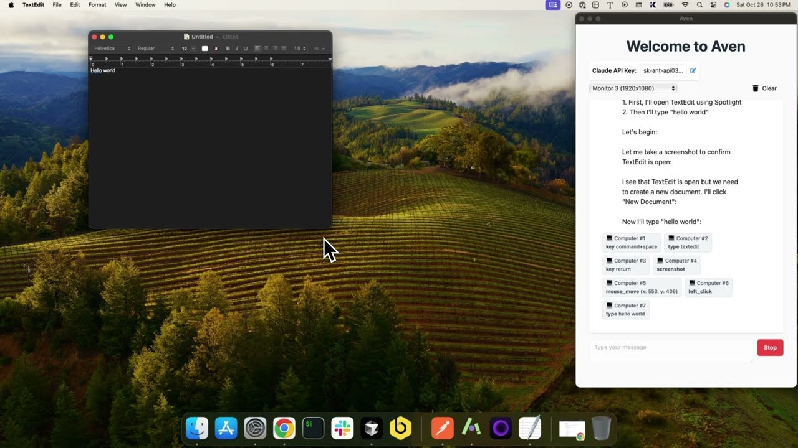

# Aven

Control your computer with Claude 3.5 Sonnet computer use capabilities: https://www.anthropic.com/news/3-5-models-and-computer-use. This is a desktop app built with Tauri, the Vercel AI SDK and React to demonstrate the computer use capabilities of Claude.
